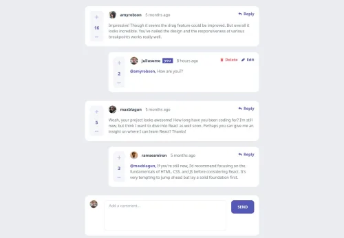
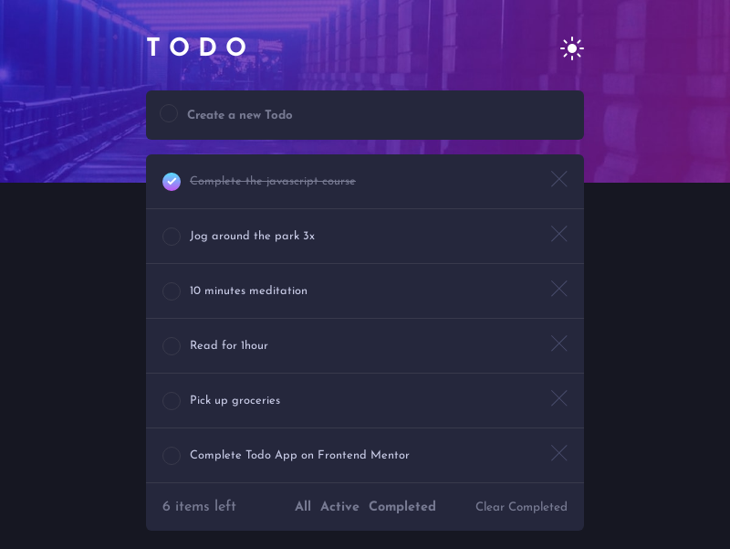
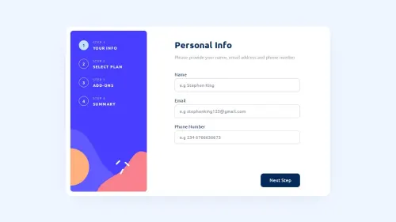

# Dev0xGenius!

🚀 **Front-end Developer** | 🔒 

I am passionate about building scalable applications, exploring the latest in technology, and solving complex problems. Welcome to my GitHub profile! 🌟

---

## 🔧 Technologies & Tools

---

## 🌟 Featured Projects

### [Project 1: Interactive Comments Section](https://interactive-comments-section-opal.vercel.app/)
  
A sleek and modern comment section

- **Technologies**: React, Tailwind CSS, Vercel, Nodejs, Express
- **Features**: Responsive design, Interactive UI, optimized performance, and animations, CRUD operations

---

### [Project 2: E-Commerce Product Page](https://ecommerce-product-page-drab-five.vercel.app/)

Shopping Product Cart, basically? Just check it out

- **Technologies**: React, React-Booststrap, Vercel
- **Features**: Interactive UI, Responsive Design

---

### [Project 3: Basic Todo App with Drag and Drop Feature](https://dev0xgenius-todo-app.vercel.app/)
  
Todo: Update this description

- **Technologies**: React, Sass, DND(drap & drop kit)
- **Features**: Manage Todos, Sort Todos, and Re-arrange too

---

### [Project 4: Multi Step Form](https://multi-step-form-theta-lovat.vercel.app/)
  
Multi Paged Form - Step by Step 

- **Technologies**: ReactRouterv7, MUI for UI Components, Zod for Parsing Form Data, react-hook-form for handling form
- **Features**: Form Validation, Responsive Web Design

## 📊 GitHub Stats

---

## 📫 Let's Connect
- [Telegram](https://t.me/dev_0xg3nius)

---

Thanks for visiting! Feel free to explore my repositories and reach out if you'd like to collaborate. 😄
