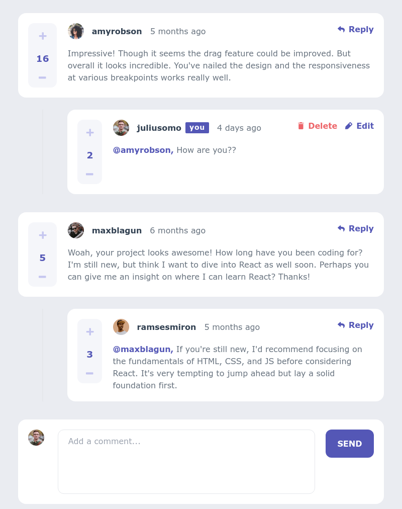
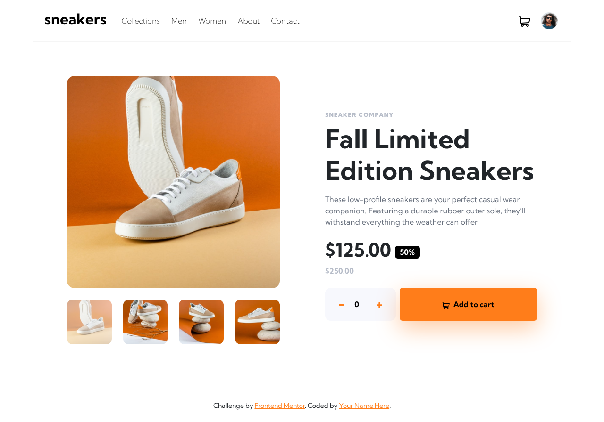

# Dev0xGenius!

🚀 **Full-Stack Developer** | 🔒 

I am passionate about building scalable applications, exploring the latest in technology, and solving complex problems. Welcome to my GitHub profile! 🌟

---

## 🔧 Technologies & Tools

---

## 🌟 Featured Projects

### [Project 1: Interactive Comments Section](https://interactive-comments-section-opal.vercel.app/)

_A sleek and modern comments section

- **Technologies**: React, Tailwind CSS, Vercel, Nodejs, Express, PostgreSQL
- **Features**: Responsive design, Interactive UI, optimized performance, and animations, CRUD operations

---

### [Project 2: E-Commerce Product Page](https://interactive-comments-section-opal.vercel.app/)

_A productivity application to manage your daily tasks and stay organized._

- **Technologies**: React, React-Booststrap, Vercel
- **Features**: interactive UI, Responsive Design

---

### [Project 3: E-Commerce Platform](https://example-link.com)

_A scalable e-commerce platform with a secure payment gateway and admin panel._

- **Technologies**: Python, Django, SQLite
- **Features**: Product listing, shopping cart, and order tracking

---

## 📊 GitHub Stats

---

## 🎯 Fun Facts
- 🌱 I’m currently learning Kubernetes and advanced machine learning techniques.
- 🕹️ In my free time, I enjoy gaming and contributing to open-source projects.
- 🌍 I love traveling and exploring different cultures.

---

## 📫 Let's Connect
- [LinkedIn](https://linkedin.com/in/dev0xgenius)
- [Twitter](https://twitter.com/dev0xgenius)
- [Personal Website](https://dev0xgenius.com)

---

Thanks for visiting! Feel free to explore my repositories and reach out if you'd like to collaborate. 😄
